# IPTV Backend System

## Entity Relationship Diagram

This document provides a comprehensive overview of the database schema and entity relationships for the IPTV Backend System.

### System Overview

The IPTV Backend manages content distribution through a hierarchical system:

- **Content Management**: Applications, Categories, Sub-Categories
- **User Management**: Role-based access control (Super Admin, Admin, Reseller, Sub-Reseller, User)
- **Content Organization**: Bouquets group content for market-specific distribution
- **Media Content**: Streams, Movies, Series, Dramas, Radio stations
- **Assignment System**: Applications and content assigned to resellers
- **Configuration**: Admin permissions and system settings

### Core Entities and Relationships

```mermaid
erDiagram
    %% User Management
    Users {
        uuid id PK
        string first_name
        string last_name
        string email UK
        string password
        enum user_type "SUPER_ADMIN, ADMIN, RESELLER, SUB_RESELLER, USER"
        boolean is_active
        datetime created_at
        datetime updated_at
        datetime deleted_at
    }

    %% Application Management
    Application {
        uuid id PK
        string name UK
        string description
        enum status "ACTIVE, INACTIVE"
        datetime created_at
        datetime updated_at
        datetime deleted_at
    }

    Categories {
        uuid id PK
        string name UK
        string description
        enum status "ACTIVE, INACTIVE"
        datetime created_at
        datetime updated_at
        datetime deleted_at
    }

    SubCategories {
        uuid id PK
        uuid category_id FK
        string name
        string description
        enum status "ACTIVE, INACTIVE"
        datetime created_at
        datetime updated_at
        datetime deleted_at
    }

    ApplicationCategories {
        uuid id PK
        uuid application_id FK
        uuid category_id FK
        uuid sub_category_id FK
        string description
        enum status "ACTIVE, INACTIVE"
        datetime created_at
        datetime updated_at
        datetime deleted_at
    }

    %% Assignment System
    ApplicationAssignment {
        uuid id PK
        uuid application_id FK
        uuid reseller_id FK
        datetime assigned_at
        boolean is_active
        datetime created_at
        datetime updated_at
        datetime deleted_at
    }

    %% Admin Configuration
    AdminConfig {
        uuid id PK
        string module_name UK
        boolean allow_admin_crud
        boolean admin_view_only
        string description
        datetime created_at
        datetime updated_at
        datetime deleted_at
    }

    %% Bouquet System
    Bouquet {
        uuid id PK
        string name UK
        enum region "NORTH_AMERICA, EUROPE, ASIA, AFRICA, SOUTH_AMERICA, AUSTRALIA, MIDDLE_EAST"
        string description
        enum status "ENABLED, DISABLED"
        datetime created_at
        datetime updated_at
        datetime deleted_at
    }

    BouquetMergeLog {
        uuid id PK
        string source_ids "JSON array"
        uuid target_id FK
        uuid actor_id FK
        enum action "MERGE_AND_DISABLE, MERGE_AND_DELETE"
        datetime created_at
    }

    %% Streaming Infrastructure
    Server {
        uuid id PK
        string name UK
        string host
        integer port
        enum status "ACTIVE, INACTIVE, MAINTENANCE"
        datetime created_at
        datetime updated_at
        datetime deleted_at
    }

    EpgSource {
        uuid id PK
        string name UK
        string url
        enum status "ACTIVE, INACTIVE"
        datetime created_at
        datetime updated_at
        datetime deleted_at
    }

    %% Media Content
    Stream {
        uuid id PK
        string name
        string description
        string stream_url
        enum quality "SD, HD, FHD, UHD"
        enum status "ACTIVE, INACTIVE"
        boolean is_p2p_enabled
        uuid epg_source_id FK
        string logo_url
        datetime created_at
        datetime updated_at
        datetime deleted_at
    }

    Movie {
        uuid id PK
        string title
        string description
        string poster_url
        string trailer_url
        string movie_url
        integer duration_minutes
        date release_date
        enum genre "ACTION, COMEDY, DRAMA, HORROR, SCI_FI, ROMANCE, THRILLER, DOCUMENTARY, ANIMATION, FANTASY"
        enum rating "G, PG, PG_13, R, NC_17"
        enum quality "SD, HD, FHD, UHD"
        enum status "ACTIVE, INACTIVE"
        decimal imdb_rating
        string imdb_id
        string tmdb_id
        datetime created_at
        datetime updated_at
        datetime deleted_at
    }

    Series {
        uuid id PK
        string title
        string description
        string poster_url
        string trailer_url
        enum genre "ACTION, COMEDY, DRAMA, HORROR, SCI_FI, ROMANCE, THRILLER, DOCUMENTARY, ANIMATION, FANTASY"
        enum rating "G, PG, PG_13, R, NC_17"
        enum status "ONGOING, COMPLETED, CANCELLED"
        date release_date
        decimal imdb_rating
        string imdb_id
        string tmdb_id
        datetime created_at
        datetime updated_at
        datetime deleted_at
    }

    Season {
        uuid id PK
        uuid series_id FK
        integer season_number UK
        string title
        string description
        string poster_url
        date release_date
        enum status "ACTIVE, INACTIVE"
        datetime created_at
        datetime updated_at
        datetime deleted_at
    }

    Episode {
        uuid id PK
        uuid season_id FK
        integer episode_number UK
        string title
        string description
        string episode_url
        integer duration_minutes
        date air_date
        enum quality "SD, HD, FHD, UHD"
        enum status "ACTIVE, INACTIVE"
        datetime created_at
        datetime updated_at
        datetime deleted_at
    }

    Drama {
        uuid id PK
        string title
        string description
        string poster_url
        string trailer_url
        enum genre "ROMANCE, FAMILY, HISTORICAL, MODERN, COMEDY, THRILLER"
        enum rating "G, PG, PG_13, R, NC_17"
        enum status "ONGOING, COMPLETED, CANCELLED"
        date release_date
        string origin_country
        datetime created_at
        datetime updated_at
        datetime deleted_at
    }

    DramaEpisode {
        uuid id PK
        uuid drama_id FK
        integer episode_number UK
        string title
        string description
        string episode_url
        integer duration_minutes
        date air_date
        enum quality "SD, HD, FHD, UHD"
        enum status "ACTIVE, INACTIVE"
        datetime created_at
        datetime updated_at
        datetime deleted_at
    }

    Radio {
        uuid id PK
        string name
        string description
        string stream_url
        enum genre "MUSIC, NEWS, TALK, SPORTS, RELIGIOUS, EDUCATIONAL"
        string country
        string language
        enum quality "LOW, MEDIUM, HIGH"
        enum status "ACTIVE, INACTIVE"
        string logo_url
        datetime created_at
        datetime updated_at
        datetime deleted_at
    }

    %% Relationships
    Categories ||--o{ SubCategories : "has"
    Application ||--o{ ApplicationCategories : "belongs_to"
    Categories ||--o{ ApplicationCategories : "belongs_to"
    SubCategories ||--o{ ApplicationCategories : "belongs_to"

    Application ||--o{ ApplicationAssignment : "assigned_to"
    Users ||--o{ ApplicationAssignment : "assigned_to"

    Users ||--o{ BouquetMergeLog : "performed_by"
    Bouquet ||--o{ BouquetMergeLog : "target_of"

    EpgSource ||--o{ Stream : "provides_epg"
    Series ||--o{ Season : "has"
    Season ||--o{ Episode : "contains"
    Drama ||--o{ DramaEpisode : "contains"

    %% Many-to-Many Relationships (Junction Tables)
    Bouquet ||--o{ StreamBouquets : "contains"
    Stream ||--o{ StreamBouquets : "belongs_to"

    Bouquet ||--o{ MovieBouquets : "contains"
    Movie ||--o{ MovieBouquets : "belongs_to"

    Bouquet ||--o{ SeriesBouquets : "contains"
    Series ||--o{ SeriesBouquets : "belongs_to"

    Bouquet ||--o{ DramaBouquets : "contains"
    Drama ||--o{ DramaBouquets : "belongs_to"

    Bouquet ||--o{ RadioBouquets : "contains"
    Radio ||--o{ RadioBouquets : "belongs_to"

    Stream ||--o{ StreamServers : "served_by"
    Server ||--o{ StreamServers : "serves"

    Movie ||--o{ MovieCategories : "categorized_as"
    Categories ||--o{ MovieCategories : "categorizes"

    Series ||--o{ SeriesCategories : "categorized_as"
    Categories ||--o{ SeriesCategories : "categorizes"

    Drama ||--o{ DramaCategories : "categorized_as"
    Categories ||--o{ DramaCategories : "categorizes"

    Radio ||--o{ RadioCategories : "categorized_as"
    Categories ||--o{ RadioCategories : "categorizes"

    %% Junction Table Definitions
    StreamBouquets {
        uuid stream_id PK,FK
        uuid bouquet_id PK,FK
        datetime assigned_at
    }

    MovieBouquets {
        uuid movie_id PK,FK
        uuid bouquet_id PK,FK
        datetime assigned_at
    }

    SeriesBouquets {
        uuid series_id PK,FK
        uuid bouquet_id PK,FK
        datetime assigned_at
    }

    DramaBouquets {
        uuid drama_id PK,FK
        uuid bouquet_id PK,FK
        datetime assigned_at
    }

    RadioBouquets {
        uuid radio_id PK,FK
        uuid bouquet_id PK,FK
        datetime assigned_at
    }

    StreamServers {
        uuid stream_id PK,FK
        uuid server_id PK,FK
        datetime assigned_at
        boolean is_primary
    }

    MovieCategories {
        uuid movie_id PK,FK
        uuid category_id PK,FK
        datetime assigned_at
    }

    SeriesCategories {
        uuid series_id PK,FK
        uuid category_id PK,FK
        datetime assigned_at
    }

    DramaCategories {
        uuid drama_id PK,FK
        uuid category_id PK,FK
        datetime assigned_at
    }

    RadioCategories {
        uuid radio_id PK,FK
        uuid category_id PK,FK
        datetime assigned_at
    }
```

### Key Entity Descriptions

#### User Management

- **Users**: Core user entity with role-based access control
- **AdminConfig**: Configurable permissions for admin access to different modules

#### Application Structure

- **Application**: Top-level content containers
- **Categories/SubCategories**: Hierarchical content classification
- **ApplicationCategories**: Links applications to their categories
- **ApplicationAssignment**: Assigns applications to resellers

#### Content Organization

- **Bouquet**: Market-specific content packages that group various media types
- **BouquetMergeLog**: Audit trail for bouquet consolidation operations

#### Media Content

- **Stream**: Live streaming channels with EPG integration
- **Movie**: On-demand movies with metadata
- **Series/Season/Episode**: Hierarchical TV series structure
- **Drama/DramaEpisode**: Drama series with episodes
- **Radio**: Radio station streaming

#### Infrastructure

- **Server**: Streaming servers for content delivery
- **EpgSource**: Electronic Program Guide sources

### Role-Based Access Control

| Role             | Description         | Access Level                      |
| ---------------- | ------------------- | --------------------------------- |
| **Super Admin**  | Full system access  | All modules, all operations       |
| **Admin**        | Configurable access | Based on AdminConfig settings     |
| **Reseller**     | Limited management  | Assigned applications and content |
| **Sub-Reseller** | Restricted access   | Subset of reseller permissions    |
| **User**         | End-user access     | Content consumption only          |

### Key Features

1. **Soft Delete**: All entities support logical deletion with `deleted_at` timestamps
2. **Audit Trail**: Creation and update timestamps on all entities
3. **Status Management**: Configurable active/inactive states
4. **Content Association**: Flexible many-to-many relationships between bouquets and content
5. **Geographic Distribution**: Region-based bouquet organization
6. **Quality Management**: Multiple quality levels for streaming content
7. **Metadata Integration**: IMDB/TMDB integration for rich content metadata

### Database Constraints

- **Unique Constraints**: Names, emails, and identifiers are unique where appropriate
- **Foreign Key Constraints**: Referential integrity maintained across all relationships
- **Composite Keys**: Junction tables use composite primary keys
- **Cascading**: Proper cascade rules for data consistency

This ER diagram represents a complete IPTV content management and distribution system with comprehensive role-based access control and flexible content organization capabilities.

## Visual Table Relationship Diagram

Below is a visual representation of how tables are connected and related in the system:

```mermaid
graph TB
    %% User Management Cluster
    subgraph "User Management"
        Users[Users]
        AdminConfig[AdminConfig]
    end

    %% Application Management Cluster
    subgraph "Application Management"
        Application[Application]
        Categories[Categories]
        SubCategories[SubCategories]
        ApplicationCategories[ApplicationCategories]
        ApplicationAssignment[ApplicationAssignment]
    end

    %% Bouquet System Cluster
    subgraph "Bouquet System"
        Bouquet[Bouquet]
        BouquetMergeLog[BouquetMergeLog]
    end

    %% Infrastructure Cluster
    subgraph "Infrastructure"
        Server[Server]
        EpgSource[EpgSource]
    end

    %% Media Content Cluster
    subgraph "Media Content"
        Stream[Stream]
        Movie[Movie]
        Series[Series]
        Season[Season]
        Episode[Episode]
        Drama[Drama]
        DramaEpisode[DramaEpisode]
        Radio[Radio]
    end

    %% Junction Tables Cluster
    subgraph "Content Associations"
        StreamBouquets[StreamBouquets]
        MovieBouquets[MovieBouquets]
        SeriesBouquets[SeriesBouquets]
        DramaBouquets[DramaBouquets]
        RadioBouquets[RadioBouquets]
        StreamServers[StreamServers]
        MovieCategories[MovieCategories]
        SeriesCategories[SeriesCategories]
        DramaCategories[DramaCategories]
        RadioCategories[RadioCategories]
    end

    %% User Management Relationships
    Users --> ApplicationAssignment
    Users --> BouquetMergeLog

    %% Application Management Relationships
    Categories --> SubCategories
    Application --> ApplicationCategories
    Categories --> ApplicationCategories
    SubCategories --> ApplicationCategories
    Application --> ApplicationAssignment

    %% Bouquet Relationships
    Bouquet --> BouquetMergeLog
    Users --> BouquetMergeLog

    %% Infrastructure Relationships
    EpgSource --> Stream
    Server --> StreamServers
    Stream --> StreamServers

    %% Media Content Hierarchical Relationships
    Series --> Season
    Season --> Episode
    Drama --> DramaEpisode

    %% Content to Bouquet Associations
    Bouquet --> StreamBouquets
    Stream --> StreamBouquets
    Bouquet --> MovieBouquets
    Movie --> MovieBouquets
    Bouquet --> SeriesBouquets
    Series --> SeriesBouquets
    Bouquet --> DramaBouquets
    Drama --> DramaBouquets
    Bouquet --> RadioBouquets
    Radio --> RadioBouquets

    %% Content to Category Associations
    Categories --> MovieCategories
    Movie --> MovieCategories
    Categories --> SeriesCategories
    Series --> SeriesCategories
    Categories --> DramaCategories
    Drama --> DramaCategories
    Categories --> RadioCategories
    Radio --> RadioCategories

    %% Styling
    classDef userManagement fill:#e1f5fe,stroke:#01579b,stroke-width:2px
    classDef applicationManagement fill:#f3e5f5,stroke:#4a148c,stroke-width:2px
    classDef bouquetSystem fill:#e8f5e8,stroke:#1b5e20,stroke-width:2px
    classDef infrastructure fill:#fff3e0,stroke:#e65100,stroke-width:2px
    classDef mediaContent fill:#fce4ec,stroke:#880e4f,stroke-width:2px
    classDef junctionTables fill:#f1f8e9,stroke:#33691e,stroke-width:2px

    class Users,AdminConfig userManagement
    class Application,Categories,SubCategories,ApplicationCategories,ApplicationAssignment applicationManagement
    class Bouquet,BouquetMergeLog bouquetSystem
    class Server,EpgSource infrastructure
    class Stream,Movie,Series,Season,Episode,Drama,DramaEpisode,Radio mediaContent
    class StreamBouquets,MovieBouquets,SeriesBouquets,DramaBouquets,RadioBouquets,StreamServers,MovieCategories,SeriesCategories,DramaCategories,RadioCategories junctionTables
```

## Table Relationship Summary

### **Core Entity Groups:**

1. **🔵 User Management** (Blue)
   - **Users**: Central user entity with role-based access
   - **AdminConfig**: Configurable admin permissions per module

2. **🟣 Application Management** (Purple)
   - **Application**: Top-level content containers
   - **Categories/SubCategories**: Hierarchical classification system
   - **ApplicationCategories**: Links applications to categories
   - **ApplicationAssignment**: Assigns applications to resellers

3. **🟢 Bouquet System** (Green)
   - **Bouquet**: Market-specific content packages
   - **BouquetMergeLog**: Audit trail for consolidation operations

4. **🟠 Infrastructure** (Orange)
   - **Server**: Content delivery infrastructure
   - **EpgSource**: Electronic Program Guide sources

5. **🔴 Media Content** (Red)
   - **Stream**: Live streaming channels
   - **Movie**: On-demand movies
   - **Series/Season/Episode**: TV series hierarchy
   - **Drama/DramaEpisode**: Drama series
   - **Radio**: Radio stations

6. **🟡 Junction Tables** (Yellow)
   - **Content-Bouquet Associations**: Links content to bouquets
   - **Content-Category Associations**: Links content to categories
   - **Stream-Server Associations**: Links streams to servers

### **Key Relationship Patterns:**

- **📊 Hierarchical**: Categories → SubCategories, Series → Season → Episode
- **🔗 Many-to-Many**: Content ↔ Bouquets, Content ↔ Categories
- **👥 Assignment**: Users ↔ Applications, Users ↔ Bouquet operations
- **📝 Audit**: All major operations logged with user tracking
- **🌍 Geographic**: Bouquets organized by regions for market distribution

This visual representation shows how the system maintains data integrity while providing flexible content organization and role-based access control.
